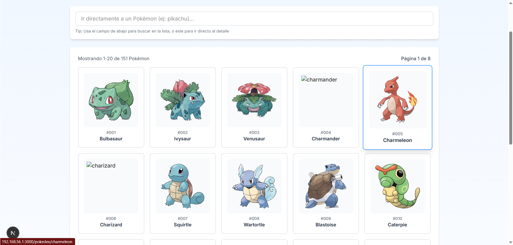
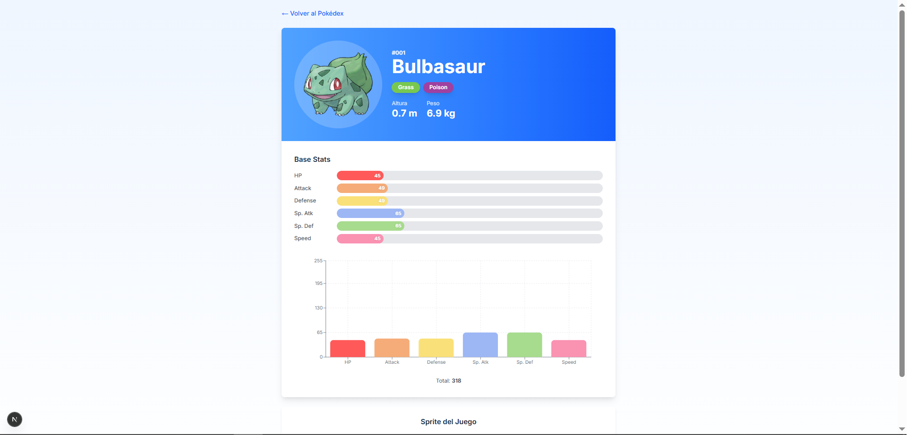

# Mini Pokédex

Una aplicación web construida con Next.js 14 (App Router) que permite explorar Pokémon de la primera generación usando la PokeAPI.

## Características

- 📋 Listado de Pokémon con paginación
- 🔍 Búsqueda por nombre
- 📊 Vista detallada con estadísticas base
- 📈 Gráfico de barras para visualizar stats
- 🎨 Interfaz responsive y limpia
- ⚡ Server Components para mejor performance

## Stack Tecnológico

- **Next.js 14** (App Router)
- **TypeScript**
- **Tailwind CSS**
- **Recharts** (gráficos)
- **PokeAPI**

## Instalación

1. Clona el repositorio:
```bash
git clone <tu-repo>
cd mini-pokedex
```

2. Instala las dependencias:
```bash
npm install
```

3. Ejecuta el proyecto en modo desarrollo:
```bash
npm run dev
```

4. Abre tu navegador en [http://localhost:3000](http://localhost:3000)

## Estructura del Proyecto

```
mini-pokedex/
├── app/
│   ├── layout.tsx
│   ├── page.tsx
│   ├── pokedex/
│   │   ├── page.tsx
│   │   ├── loading.tsx
│   │   ├── error.tsx
│   │   └── [name]/
│   │       ├── page.tsx
│   │       └── loading.tsx
├── components/
│   ├── pokemon-card.tsx
│   └── stats-chart.tsx
├── lib/
│   └── pokeapi.ts
└── README.md
```

## Rutas

- `/` - Página principal (redirige a /pokedex)
- `/pokedex` - Listado de Pokémon con búsqueda y paginación
- `/pokedex/[name]` - Vista detallada de un Pokémon específico

## Funcionalidades

### Listado de Pokémon
- Muestra 20 Pokémon por página
- Navegación con botones Anterior/Siguiente
- Búsqueda directa por nombre
- Imágenes oficiales de cada Pokémon

### Vista de Detalle
- Sprite del Pokémon
- Tipos, altura y peso
- Estadísticas base con gráfico de barras interactivo
- Botón para volver al listado

## API Utilizada

Este proyecto consume la [PokeAPI](https://pokeapi.co/) para obtener información sobre los Pokémon:

- Lista: `https://pokeapi.co/api/v2/pokemon?limit=20&offset=0`
- Detalle: `https://pokeapi.co/api/v2/pokemon/{name}`

## Capturas de Pantalla

### Listado (/pokedex)


### Detalle (/pokedex/bulbasaur)


## Comandos Disponibles

```bash
npm run dev      # Modo desarrollo
npm run build    # Construir para producción
npm run start    # Ejecutar build de producción
npm run lint     # Ejecutar linter
```

## Mejoras Futuras (Bonus)

- [ ] Sistema de favoritos con localStorage
- [ ] Autocomplete en búsqueda
- [ ] Dark mode
- [ ] Filtros por tipo
- [ ] Comparación de Pokémon

## Licencia

MIT
